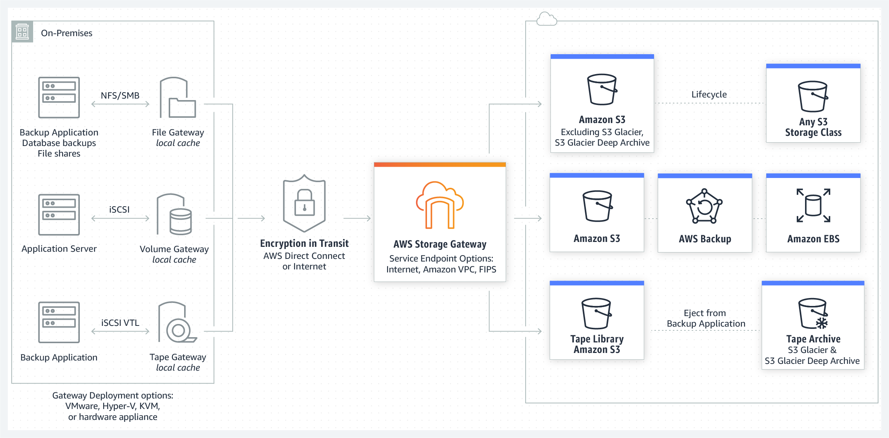
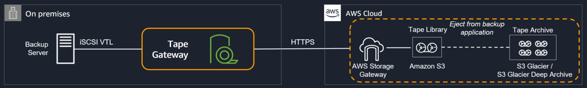

# AWS Sysops Notes

## AWS Organization

You can send an invite to existing accounts, to link them to the central organization.

## System Manager

1. Document  
 1.1 AWSSupport-ExecuteEC2Rescue to recover impaired instances  
2.
## AWS EventBridge

Serverless event bus connecting applications using event.

Needs proper permission to make api calls. For Lambda, Amazon SNS, Amazon SQS, and Amazon CloudWatch Logs resources, EventBridge relies on resource-based policies. For Kinesis streams, EventBridge relies on IAM roles.
## EC2

### Spot instance

Spot **block** instance -  Spot instances with a specified duration
### On-Demond Capacity Reservation:

1. reserve capacity in an AZ
2. does not offer any billing discount
3. cannot be used for placement group or dedicated host.
4. not transferable but can be shared

### AMI sharing

1. can only share AMI have un-encrypted volumes and volumes encrypted with a customer-managed CMK
2. CMK must be shared too.
3. don't need to share the EBS snapshot that AMI references to share AMI.

## AWS Directory Services

Default inbound rules allow 0.0.0.0/0 but it's not security concern.
Refs: [AWS FAQ](https://aws.amazon.com/premiumsupport/faqs/)

## CloudFormation

IAM resource is globally unique w/ your account. If try to create same IAM resource in different region via CF, your stack might share these resource and behavior oddly.

### **StackSets**

[what is StackSets](https://docs.aws.amazon.com/AWSCloudFormation/latest/UserGuide/what-is-cfnstacksets.html)

1. allows to roll out CloudFormation stacks over multiple accounts and regions
2. offers the option for automatically creating or removing your CloudFormation stacks when a new AWS account joins or quits your Organization
3. 

## ELB

Notes: If all nodes are unhealthy, ELB will route traffic to unhealthy nodes.

### __ELB for SysOps__

1. static IP only for NLB
2. support SSL for older browsers: change LB security group to support a weaker cipher

### To deploy a new app version to EC2 behind an ALB created by CloudFormation

1. always try to update the resources deployed by CF by updating the stack, rather than updating resources directly
2. Modify CF to use **AutoScalingReplacingUpdate** policy. Update the stack. Perform a second update wit the new release. **AutoScalingRollingUpdate policy** to control rolling update.

## __Auto Scaling Group__

**Scaling on Demand**

You can not only define scaling policy based on aws metrics but also custom metric, or even based on a schedule.**

1. Send custom metric from application on EC2 to CloudWatch(PutMetric API)
2. Create CloudWatch alarm to react to high/low values
3. Use CloudWatch alarm as the scaling policy for ASG

**ASG is free.**

**Launch configuration is immutable, cannot update. Only recreate.**

### __ASG for SysOps__

1. High availability - Multi-AZ
2. Healthcheck  
 2.1 EC2 status check - checking VM health  
 2.2 **ELB Health check - checking application**  
3. ASG will launch a new ins after terminating an unhealthy one
4. ASG won;t reboot unhealthy hosts
5. CLI  
 5.1 set-instance-health  
 5.2 terminate-instance-in-auto-scaling-group

### __Troubleshooting ASG issues__

1. Launching EC2 failure.  
 1.1 ASG has reached the limit set by the DesiredCapacity  
 1.2 Security Group is not existing  
 1.3 key pair not existing  
2. If ASG fails to launch an instance for over 24 hours, it will automatically suspend the process ( administration suspension)  

### __CloudWatch Metrics for ASG__

**Custom metrics Dashboard**

1. add a text widget
2. select appropriate metric from custom namespace
3. add to dashboard.

## __Beanstalk for SysOps__

1. Logs go to CloudWatch
2. AWS managed infra
3. deployment modes:  
 3.1 All at once: downtime  
 3.2 Rolling  
 3.3 Rolling with additional batches  
 3.4 Immutable: new ASG, swap all the instances  
 3.5 Blue/Green: swap URL  
4. custom domain: Route53 ALIAS or CNAME on Beanstalk URL
5. no need for patching the runtime: Node.js, PHP..

## __E2 Storage__

### __EBS & EFS__

#### __EBS__

0. block storage
1. network drive,  might be a bit latency
2. locked to AZ, snapshot to move across AZ
3. Provisioned capacity GBs IOPS
4. types  
 4.1 GP2 SSD: general purpose SSD  
  4.1.1 ec2 boot volume  
  4.1.2 I/O burst  
 4.2 IO1 SSD: highest performance SSD, more than 16,000 IOPS(GP2 limit), best choice for DB storage, max ratio 50:1 IOPS:GB  
 4.3 STI HDD: low cost HDD for frequently accessed, throughput intensive workloads. bigdata, and etc  
 4.4 SCI HDD: lowest cost HDD for infrequent access  
5. computing MB/s based on IOPS  
 5.1 gp2: MiB/s=(size in GiB)x(IOPS per GiB)x(I/O size in KiB)  

    ```code
    disk size: 100 GiB
    3 IOPS per GiB
    256 KiB Per IO
    throughput in MiB is 100x3x256KiB/s = 75MiB/s
    ```

    __Notes: Limit to 250MiB/s, which means volume >=344 GiB won't increase throughput__  
 5.2 io1: MiB/s=(Provisioned IOPS)x(I/O size in KiB)  
         256KiB/s for each provisioned IOPS  
    __Notes: Limit to a max of 500 MiB/s (at 32k IOPS) and 1000 MiB/s (at 64k IOPS)__

6. You can resize EBS volume, but only increase, and need to repartition to use the incremental storage
7. Snapshot  
 7.1 incremental copy only changed blocks  
 7.2 backup use IOs  
 7.3 recommended to detach volume to do snapshot  
 7.4 can be copied across AZ  
 7.5 can make AMI from snapshot  
 7.6 EBS restored from a snapshot need to be pre-warmed ( using fio or dd command to read entire volume)  
 7.7 snapshot can be automated using Amazon Data Lifecycle Manager( **via CloudWatch Event - scheduled**)  
8. Encryption  
 8.1 Data at rest/data in flight/snapshot/volumes restored from snapshot all encrypted  
 8.2 minimal impact on latency  
 8.3 encrypt key from KMS  
 8.4 copy an un-encrypted snapshot allows encryption  
 8.5 To encrypt an un-encrypted EBS volume  

    ```code
    create snapshot of the volume
    encrypt EBS volume using copy
    create new ebs volume from the snapshot
    attach the encrypt volume to original instance
    ```

#### __EBS vs EC2 Instance Store__

1. some instance don't come with EBS root volume, instead they have "Instance Store" = ephemeral storage
2. physically attached to the machine compared to EBS as a network drive
3. good performance, very high IOPS, best for cache, buffer
4. cannot resize, backup by user, lost after termination

#### __EBS RAID__

1. RAID 0 to increase IOPS
2. RAID 1 to increase fault tolerance

#### __EBS CloudWatch__

1. VolumeIdelTime | VolumeQueueLength | BurstBalance
2. GP2 5min interval, IO1 1min interval
3. Status: OK Warning Impaired

#### __EFS__

1. Managed Network File System - NFS, works with EC2 in multi-AZ. 
2. Highly available, scalable, expense 3X gp2, pay per use
3. Content management, web severing, data sharing, wordpress..
4. NFS V4.1
5. security group to control access to EFS
6. EFS scale:  
 6.1 1000s of concurrent NFS clients, 10GB+ throughput  
 6.2 Grow to Petabyte-scale network file system  
7. Performance mode(set at EFS creation time):  
 7.1 general purpose: latency-sensitive use case, web server, CMS, etc..  
 7.2 max IO: higher latency, higher throughput, highly parallel, for big data, media processing..  

## __S3 for SysOps__

## S3 Encryption

Default encryption only support bucket level.

SSE-S3: s3:x-amz-server-side-encryption: true

SSE-KMS

### Retention

1. object level - specify a Retain Until Date.
2. bucket default - specify a duration.

### S3 server access log vs CloudTrail

Server access logging is free, default disable. Can log very detailed access info, saved into another S3 bucket.

CloudTrail only log bucket-level API calls.

### __S3 versioning for SysOps__

1. encrypt a file will create a new version to protect data loss
2. delete a file only adds a delete marker on the versioning
3. to delete a bucket, you need to remove all the file versions with the bucket

### __S3 MFA Delete__

1. To use MFA Delete, enable versioning first
2. you will need MFA to  
 2.1 permanently delete an object version  
 2.2 suspend versioning  
3. You won't need MFA for
 3.1 enabling versioning  
 3.2 listing deleted versions  
4. Only **bucket owner(root account)** can enable/disable MFA delete
5. MFA delete can only be enabled using CLI

### __S3 Replication: CRR & SRR__

1. Must enable versioning in both source and destination buckets
2. Cross Region Replication & Same Region Replication
3. Buckets can be in different accounts
4. Asynchronous copy
5. need proper IAM permissions on S3

Notes:

1. After activating, only new objects re replicated, not retroactive
2. DELETE:  
 2.1 can replicate delete marker  
 2.2 Deletions with a version ID are not replicated  
3. No chaining of replication: bucket 1 -> bucket 2 -> bucket 3  
 Objects created in bucket 1 won't be replicated to bucket 3.

### __S3 Pre-signed URL__

### __CloudFront__

Content Delivery Network, improve read performance, content is cached at the edge. DDoS protection, integration with Shield, AWS Web Application Firewall. Expose external HTTPS and talk to internal HTTPS backends.

### WAF

string match to find the ID of front-end server.

#### __CloudFront - Origins__

1. S3 bucket  
 1.1 distributing files and caching them at the edge  
 1.2 enhanced security with OAI(Origin Access Identity). Cannot use when S3 used as a website endpoint, but customer origin can be used.  
 1.3 CloudFront can be used as an ingress(to upload files to S3)  
2. Custom Origin (HTTP)  
 2.1 Application LB, must be public IP and allow ingress from CloudFront  
 2.2 EC2 instance, must be public IP and allow ingress from CloudFront  
 2.3 S3 website  
 2.4 Any HTTP backend  

#### __CloudFront vs S3 CRR__

CloudFront

1. CF is Global Edge Network  
2. Files are cached for a TTL(like a day)  
3. Great for static content  

S3 CRR

1. must be setup for each region you want replication to happen  
2. Files updated in near real-time  
3. Read only  
4. Great for dynamic content needs low latency in a few regions  

### __S3 Inventory__

1. helps manage your storage
2. Audit and report on the replication and encryption status of your objects

### __S3 Analytics__

1. help determine when to transition objects from standard to standard IA
2. does not work for ONEZONE_IA or Glacier
3. daily report
4. helps work out Lifecycle rules

### __S3 Lifecycle Rules__

1. Transition actions
2. Expiration( delete ) actions
3. Rules can be created for a certain prefix or objects tags

### __S3 Performance__

#### __S3 baseline performance__

1. auto scale, low latency to the first byte read, 100-200ms
2. 3500 PUT/COPY/DELETE/POST 5000 GET/HEAD per second per prefix in a bucket
3. object path = prefix

    ```code
    bucket_a/dir_a/sub_dir_a/file_a => /dir_a/sub_dir_a/
    bucket_a/dir_a/sub_dir_b/file_b => /dir_a/sub_dir_b/
    ```

#### __KMS limitation__

If you use SSE-KMS, you may be impacted by the KMS limits.

1. Upload will call GenerateDataKey KMS API
2. Download will call Decrypt KMS API
3. KMS quota might be different 5500, 10,000, 30,000 based on region. You can request a quota increase using Service Quota Console.

### CMK

1. you cannot import a new key material into a CMK
2. CMK doesn't support auto rotation
3. So to achieve CMK rotation, you need to leverage key alias. Point to a new CMK key to "rotate" an old CMK..

#### __S3 write performance__

1. multi-part upload, 1G, 5G must
2. Transfer acceleration, through edge location to target S3 bucket. Compatible with multi-part upload

#### __S3 read performance - S3 Byte-Range Fetches__

Parallelize GETs by requesting specific byte ranges, better resilience in case of failures.

Can be used to speed up downloads, and also to retrieve partial data (for example, head of file).

### __S3 Snowball__

A physical box moving data into/from AWS.
But cannot import to Glacier directly, have to store into S3 first.

### __S3 Snowball edge__

Box with CPU/GPU. Computing while moving.

### __S3 Snowmobile__

Transfer exabytes of data 1 EB = 1,000 PB = 1,000,0000 TB

### Storage Gateway

Bridge between on-premise data and cloud data in AWS


1. File gateway  
 1.1 File access via NFS/SMB  
 1.2 cache
 1.3 backed by S3
2. volume gateway  
 2.1 Block storage, iSCSI, backed by S3  
 2.2 Cached volumes VS Storage volumes  
3. Tape gateway  
 3.1 VTL backed by S3 and Glacier  
 3.2 tape backup solution
 

#### AWS Storage Cloud Native Options

1. Block: Amazon EBS, EC2 Instance Storage
2. File: Amazon EFS
3. Object: S3, Glacier

### Athena

1. Serverless data analytics directly against S3 files.
2. SQL language to query files
3. Has JDBC/ODBC driver

## RDS

### Enhanced monitoring

Provide OS metrics

Free Mem | Active Mem | Swap Free | Process Running | File system used

### RDS Read Replicas for read scalability

1. Up to 5 read replicas
2. within AZ, cross AZ, cross Region
3. Async replication, eventually consistent
4. replica can be promoted to their own DB
5. Application must update the conn string to leverage read replicas

Troubleshoot:

1. writing to a read replica can break replication
2. `max_allowed_packet` is slower than source DB can cause error.

### RDS Multi AZ (DR)

1. SYNC replication
2. one DNS name, auto failover
3. increase availability
4. not used for scaling

### RDS backups

1. auto enabled
2. daily full snapshot of db
3. capture TXN logs in real time

### RDS Encryption

1. KMS - AES256
2. SSL encrypt inflight data
3. enforce SSL & connect using SSL

### RDS security

1. RDS db provisioned in a private subnet
2. Security Group similar to EC2 SG, controls who can communicate with rds
3. IAM controls who can manage rds
4. username/password for login
5. IAM user can be used too for MYSQL/Aurora

### Multi AZ VS Read Replics

Multi AZ|Read Replicas
----------------------------|----------------------------
increase availability|increase read scaling
has to be in one region| can be with AZ, cross AZ, cross Region
one DNS endpoint|each read replica has its one DNS endpoint
x| read replicas can be Multi-AZ
x|not supported for Oracle
backup from standby | x
low maintenance impact | x

### DB Parameter groups

1. can configure DB using parameter groups
2. dynamic parameters are applied immediately
3. static parameters applied after db instance reboot
4. can modify parameter group associated with a DB( need reboot)

### Must-know parameter

> PostgreSQL / SQL Server: rds.force_ssl=1 => force ssl conn
> MySQL/Maria DB: GRANT SELECT ON...REQUIRE SSL;

### ElastiCache

ElastiCache Memcached Engine node type is immutable. You need to create a new cluster with a new node type to scale up, and then point your application to the new endpoints.

#### Redis VS Memcached

REDIS|Memcached
-----|---------
Multi-AZ with auto-failover|Multi-node for partitioning of data(sharding)
Read Replica to scale, HA | Non persistent
Data durability using AOF persistence | No backup and restore
Backup and restore | Multi-thread feature

## Monitoring Auditing and Performance

### CloudWatch

1. Needs to be installed on EC2
2. Needs IAM role attached to EC2 to run CloudWatch agent
3. for windows, using StatsD

### CloudWatch Synthetics

Create canaries, configurable scripts that run on a schedule, to monitor endpoints/APIs, acting like a customer.
### CloudWatch Alarm

1. can be created based on CloudWatch Logs Metrics Filters
2. doesn't test or validate the actions that is assigned
3. To test alarm and notifications, set the alarm state to Alarm using CLI

```code
aws acloudwatch set-alarm-state --alarm-name "myalarm" --state-value ALARM --state-reason "testing"
```

### CloudWatch vs CloudTrail vs AWS Config

1. CloudWatch:  

- Performance monitoring & dashboards
- Events & Alerting
- Log Aggregation & Analysis

2. CloudTrail:  

- Record API calls made within you aws account
- can define trails for specific resources
- global service
- log file integrity to keep logs temper-proof

3. AWS Config

- Record AWS resources config change
- Evaluate AWS resources against compliance rules
- Auto remediation feature remediates non-compliant resources
- Get timeline of changes and compliance

## VPC

### VPC overview

1. IP range( private subnet IP only )  
10.0.0.0/16  /28  
172.0.0.0  
192.168.0.0  
2. Subnet size  
 **5 IPs always reserved in each subnet by aws for specific purpose**, for example:

    ```code
    10.0.0.0 network ip  
    10.0.0.1 VPC router  
    10.0.0.2 for mapping to amazon-provided DNS  
    10.0.0.3 reserved for future use  
    10.0.0.255 network broadcast address. AWS does not support broadcast in a VPC, reserved.  
    ```

### NACL vs SG

1. NACL - firewall on subnet level. It's stateless, which means inbound/outbound traffic will be evaluated anytime. Support Allow/Deny rules.
2. SG - firewall on instance level. Stateful, return traffic will be allowed. Only support Allow rules.

### Site to Site VPN

Setup a customer gateway on Data Center, a Virtual Private gateway on VPC, and site-to-site VPN over internet

### Direct Connect

Setup a Virtual Private Gateway on VPC, and establish a direct private connection to AWS Direct Connect Location
Data in transit is not Encrypted.

### Direct Connect Gateway: to multiple VPC in different regions

### Egress only Internet Gateway

1. Only works for IPv6
2. Similar function to NAT gateway for IPv4

### VPC endpoint

Enables you to connect to services powered by AWS PrivateLink, restricts all network traffic within AWS network.

### VPC Peering

Inter-region VPC peering encrypt inter-region traffic which always stays on global AWS backbone and never traverses the public internet.
## Route53

A record: hostname to IP
CNAME: hostname to  hostname, only works for non-root domain.
Alias: hostname to aws resource(can be in a diff account), also works for root domain.

DNS cache on client side for TTL duration

## AWS Inspector

EC2 only as Inspector agent need to be installed.

1. For network assessment

2. For host assessment:  
 2.1 security  
 2.2 CIS  
 2.3 common vul  
 2.4 runtime behavior  

## GuardDuty

Intelligent threat discovery to protect AWS account.

Input:

1. CloudTrail logs
2. VPC Flow logs
3. DNS logs

## TrustAdvisor

Analyze your account and provides recommendation:

1. cost optimization
2. performance
3. fault tolerance
4. security
5. service limit

## Cost Explorer

Use Tag Editor to create new tag, then use Billing and Cost Mgmt to make any tags as user-defined cost allocation tags to track cost.

## KMS VS HSM

KMS| HSM
----|----
only symmetric| both symmetric and asymmetric
aws key management| only hardware

## AWS Backup

Fully managed backup service to simplify and automate data backup.

EBS | EC2 | RDS | Aurora | Dynamo DB | EFS | Storage Gateway

Support multi-accounts env.

## PV vs HVM

PV(Paravirtual) AMIs aren't supported in all AWS region. You need to create a new HVM instance, copy the EBS volumes attached to the old PV instance.

